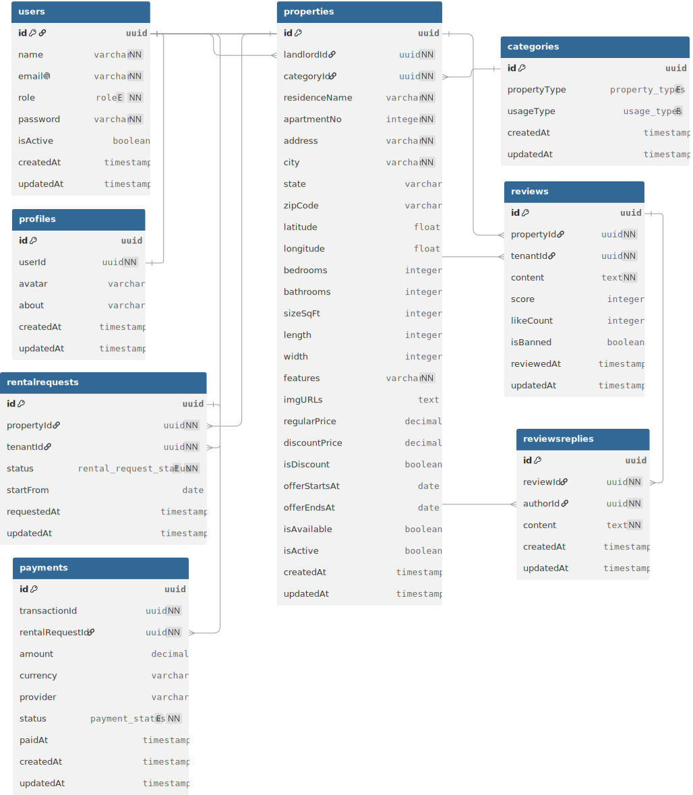

# Backend API

# RentNest – Rental Property Marketplace Backend API

## Overview

**RentNest** is a secure, scalable RESTful backend API designed for a rental property marketplace. The platform connects **tenants**, **landlords**, and **administrators** in a single ecosystem where landlords can publish rental properties, tenants can request rentals and complete online payments, and administrators can monitor the entire platform.

The system follows a **role-based access control (RBAC)** architecture and implements a complete rental lifecycle—from property discovery to payment confirmation and review submission.

---

## Problem Statement

Finding and managing rental properties often involves manual communication, inconsistent record keeping, and insecure payment processes. Existing solutions frequently lack centralized management for landlords, tenants, and administrators.

RentNest addresses these challenges by providing:

- A centralized rental management platform
- Secure authentication and authorization
- Online payment integration
- Structured rental approval workflow
- Property discovery with filtering
- Review and rating system
- Administrative moderation tools

---

## Objectives

The primary objectives of RentNest are:

- Build a secure REST API for rental management
- Simplify property listing and rental request workflows
- Enable secure online payments
- Provide role-specific functionalities
- Ensure scalability using clean architecture
- Maintain data integrity throughout the rental lifecycle

---

# User Roles

### Tenant

A tenant can:

- Register and authenticate
- Browse available properties
- Search properties using filters
- View detailed property information
- Submit rental requests
- Complete payment after approval
- Track rental history
- Leave reviews after completing rentals
- Manage profile information

---

### Landlord

A landlord can:

- Register and authenticate
- Create property listings
- Edit or delete listings
- Manage property availability
- View incoming rental requests
- Approve or reject rental requests
- View tenant history
- Monitor property performance

---

### Admin

The administrator oversees the platform by:

- Managing all users
- Banning or unbanning accounts
- Viewing all rental requests
- Monitoring all property listings
- Managing property categories
- Moderating platform activities

---

# Business Workflow

## Tenant Journey

```
Registration
      ↓
Browse Properties
      ↓
Property Details
      ↓
Submit Rental Request
      ↓
Wait for Approval
      ↓
Complete Payment
      ↓
Move In
      ↓
Leave Review
```

---

## Landlord Journey

```
Registration
      ↓
Create Listing
      ↓
Receive Rental Requests
      ↓
Approve / Reject
      ↓
Tenant Payment
      ↓
Rental Becomes Active
```

---

## Rental Lifecycle

```
Pending
    ↓
Approved
    ↓
Payment
    ↓
Active
    ↓
Completed
```

Rejected requests terminate the workflow immediately.

---

# Key Features

## Authentication & Authorization

- JWT-based authentication
- Role-Based Access Control (RBAC)
- Protected routes
- Secure password hashing
- User profile management

---

## Property Management

Landlords can:

- Create listings
- Update property information
- Delete listings
- Set availability
- Organize properties into categories

Public users can:

- Browse listings
- Search by location
- Filter by property type
- Filter by price range
- View detailed property information

---

## Rental Request System

The rental module supports:

- Rental request submission
- Approval workflow
- Rejection workflow
- Request history
- Status tracking

Request statuses include:

- Pending
- Approved
- Rejected
- Active
- Completed

---

## Online Payment

RentNest integrates with **Stripe** or **SSLCommerz**.

Features include:

- Payment session creation
- Payment verification
- Transaction history
- Payment status tracking
- Secure payment confirmation

---

## Review System

After completing a rental:

- Tenants can submit reviews
- Reviews are linked to properties
- Future tenants can evaluate landlords through previous experiences

---

## Admin Dashboard Features

Administrators can:

- Manage users
- Monitor platform activity
- Manage categories
- Review rental requests
- Moderate property listings

---

# Database Design

The system consists of the following core entities:

### Users

Stores:

- Personal information
- Authentication data
- User role
- Account status

---

### Properties

Stores:

- Property information
- Price
- Location
- Amenities
- Availability
- Landlord reference

---

### Categories

Stores property classifications such as:

- Apartment
- Studio
- House
- Villa

---

### RentalRequests

Stores:

- Tenant
- Property
- Status
- Approval history

---

### Payments

Stores:

- Transaction ID
- Amount
- Payment provider
- Payment status
- Rental reference
- Payment timestamp

---

### Reviews

Stores:

- Rating
- Comment
- Property reference
- Tenant reference

---

# Technology Stack

| Layer          | Technology          |
| -------------- | ------------------- |
| Runtime        | Node.js             |
| Framework      | Express.js          |
| Language       | TypeScript          |
| Database       | PostgreSQL          |
| ORM            | Prisma              |
| Authentication | JWT                 |
| Payment        | Stripe / SSLCommerz |
| Deployment     | Vercel / Render     |

---

# Security Considerations

The project emphasizes backend security by implementing:

- JWT authentication
- Password hashing
- Role-based authorization
- Protected API endpoints
- Input validation
- Secure payment verification
- Access control middleware
- Error handling middleware

---

# API Modules

The backend is organized into independent modules:

- Authentication
- Users
- Properties
- Categories
- Rental Requests
- Payments
- Reviews
- Admin

This modular architecture improves maintainability and scalability.

---

# Challenges

Developing RentNest involves solving several real-world backend challenges:

- Managing multiple user roles securely
- Designing a complete rental approval workflow
- Preventing unauthorized resource access
- Maintaining transactional consistency during payment
- Handling payment callbacks/webhooks reliably
- Keeping property availability synchronized with rental status
- Designing a scalable relational database using Prisma

---

# Outcomes

By completing RentNest, the project demonstrates proficiency in:

- REST API development
- TypeScript backend architecture
- PostgreSQL database modeling
- Prisma ORM
- JWT authentication
- RBAC implementation
- Payment gateway integration
- Clean modular architecture
- Secure backend development
- Real-world business workflow implementation

---

## Conclusion

RentNest is a production-oriented backend system that digitizes the rental property process through secure authentication, role-based authorization, structured rental workflows, integrated online payments, and administrative oversight. The project showcases modern backend engineering practices and provides a solid foundation for extending into a full-stack rental marketplace application with web or mobile clients.

## ERD SVG


